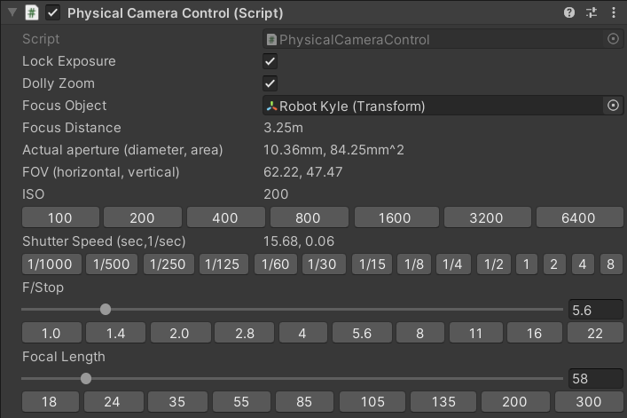
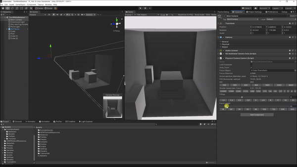
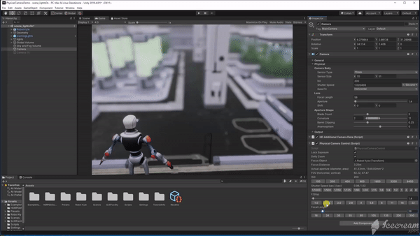

# Physical Camera Control

An editor control for the Unity HDRP physical camera.

* Provides standard camera presets for ISO, F/Stop and focal lengths.
* Exposure locking by automatically adjusting shutter speed or aperture settings.
* Dolly zoom to make it easy to frame a shot while adjusting the focal length.  

Tested with Unity 2019.4.0f1 and HDRP 7.3.1 and 7.4.1.

## Usage

* Add this as a package to Package Manager using the git URL.
* Attach the `Physical Camera Control` component to the `GameObject` with the `Camera` component.

## Tutorial Video

## Dolly Zoom

## Lock Exposure (to help set F/Stop and Depth of Field)

